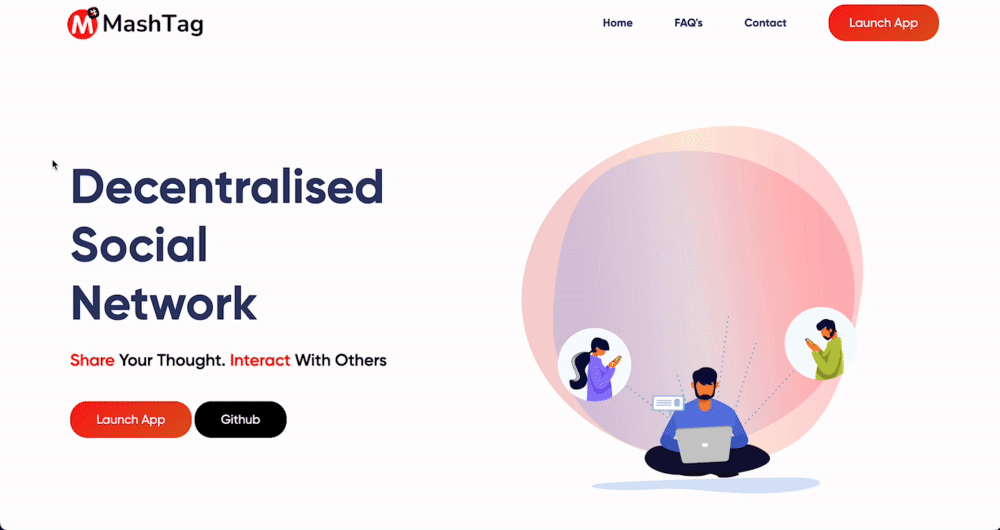
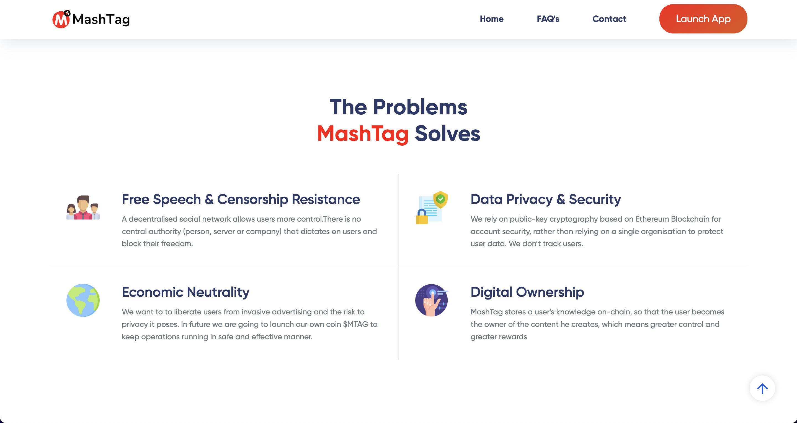

# Introducing MashTag

MashTag is a decentralised social networking service on the Ethereum Blockchain where users post and interact with messages using their wallet.

## Objectives

---

Core Objectives and Future Plans of MashTag-



- **Free Speech & Censorship Resistance** - A decentralised blogging platform allows users more control.There is no central authority (person, server or company) that dictates on users and block their freedom. It can good alternative to wiki leaks to share confidential information anomlonsy 

- **Data Privacy & Security** - We rely on public-key cryptography based on Ethereum Blockchain for account security, rather than relying on a single organisation to protect user data. We don’t track users. All data will be public to user on the blockchain.

- **Economic Neutrality** - We want to to liberate users from invasive advertising and the risk to privacy it poses. In future we are going to launch our own token $BVC to support writers and to keep operations running .

- **Digital Ownership** - BlogVerse stores a user's knowledge on-chain, so that the user becomes the owner of the content he creates, which means greater control. Users can also share their opinion without having any fear of the government bodies etc.

🔔 **New Features*:
- With the help of EPNS help, users are notified whenever they get message or notication.
- In version 2, i am going to integrate lens protocol on MashTag so that users can easily follow and interact with other users very seamless way like any web2 platforms.
- Adding support for other chains and make it a multi chain project especially Solana and BNB.
- Launch of $MTAG tokens which will run the economics of platform.
- Rewards for content creators on MashTag platform using $MTAG tokens.
- 🌍 MashTag DAO : This will help our community to take all the important decisions in a decentralized way and help in the smooth functioning of the project.

🎯 **GOAL**: Our Ultimate Goal is to reduce reliance on centralized social media platforms and provides internet users a safe, secure place to socially interact with each other.


## Implementation

---
- Frontend is built using Nextjs with TailwindCSS.
- In backend, i have created a local server using Sanity for storing data of tweets and created key-value pair of wallet address with user data.
- In smart_contract folder, hardhat testing enivorment is setup and NFT minting contract ERC721 is written which is later deployed to Polygon Mumbai testnet and Ethereum Rinkeybey chain.
- I have created on option to mint your profile pic as a  NFT by just drag and drop. For developement of this feature, i have used custom logics for with Pinata to store the image and it will be store to IPFS for NFT creation.
- After that images get minted as an NFT and get stored on the IPFS.


### WORKING DEMO OF MVP - 
https://mashtag.net

### VIDEO OF WORKING DEMO AND EXPLAINATION ABOUT THE PROJECT - 
https://youtu.be/-UzzRT1ZoPM

### TESTING GUIDE - 


1. Run the backend code to get your smart contract deployed on rinkeby network 

```
git clone https://github.com/0xshikhar/mashtag
cd smart-contract 
yarn install
yarn hardhat deploy --network rinkeby
```
- Make .env file - 
```
PRIVATE_KEY=
RPC_NODE_URL=
NEXT_PUBLIC_SANITY_TOKEN=
NEXT_PUBLIC_SANITY_PROJECT_ID=
NEXT_PUBLIC_PINATA_API_KEY=
NEXT_PUBLIC_PINATA_API_SECRET=
```

2. Now run the frontend and backend server 
```
cd ../
yarn install or npm install
yarn dev or npm run start
```

3. Go to UI and have fun!

Head over to your [localhost](http://localhost:3000) and watch it!


### **Tech Stack -**
 **BACKEND -**
- IPFS (decentralized protocol to store data )
- Hardhat ( Smart contract testing enviorment)
- Solidity (Programming Language for EVM based Smart Contracts)
- Alchemy (RPC Node Provider)
- Sanity (Backend Database Provider)
- Pinata (Using to store Data)

 **FRONTEND -**
- Nextjs 
- TailwindCSS
- Typescript 
- Eslint
- Ethers.js
- Axios
- Metamask integration

 **INFO**
- Made By - Shikhar Singh
- Github - https://github.com/0xshikhar
- Discord - 0xShikhar#0399
- Twitter - https://twitter.com/0xShikhar

# Thank you, feel free to connect with me!